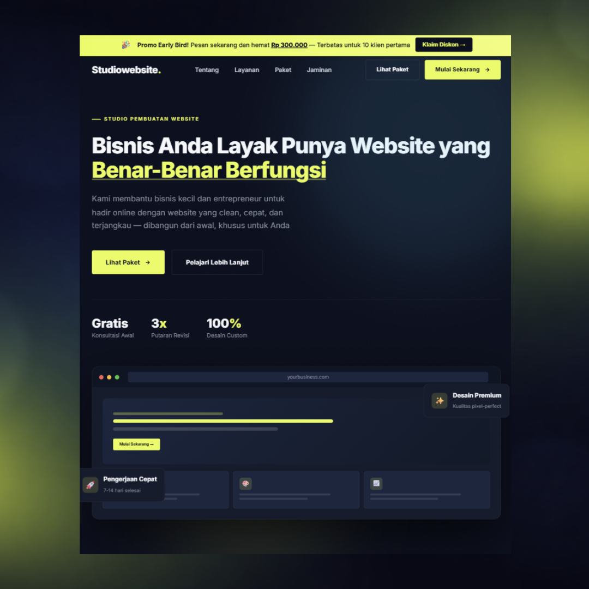

# Freelance Service Website

A personal service website built to present my freelance web development offering in a structured and professional format.

## Objective
To establish a simple and credible online presence for my freelance web services, focusing on clarity, responsiveness, and information hierarchy.

## What Was Implemented
- Responsive layout
- Clear service breakdown sections
- Contact and inquiry structure
- Basic on-page SEO adjustments
- Deployment to hosting environment

## Tech Stack
- HTML
- CSS
- JavaScript

## Status
Personal Business Website

## Preview
